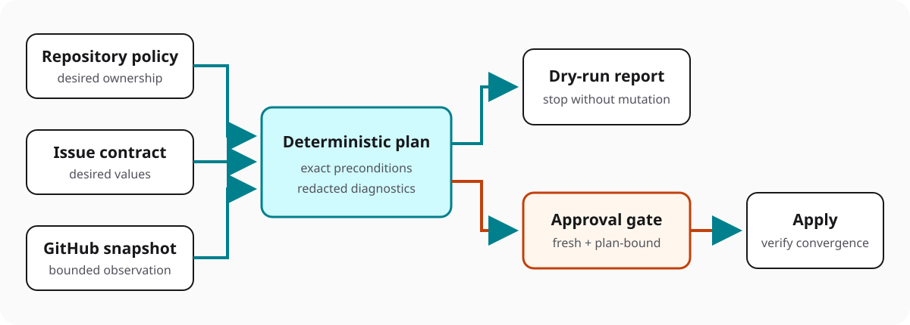

# Threat model

## Scope

Yukh Projects reads untrusted issue content and repository policy, discovers GitHub Projects state, builds a deterministic plan, and may apply authorized mutations. This threat model covers the public Action, command-line entry points, parsing and planning core, GitHub API adapters, release artifacts, and workflow examples.

## Security objectives

1. A run can mutate only the explicitly bound repository and Project.
2. Dry-run cannot acquire or exercise mutation permissions.
3. Apply requires an explicit gate and a least-privilege credential.
4. Untrusted content is parsed as data and is never executed.
5. Repeated execution is deterministic, bounded, and idempotent.
6. Logs and outputs disclose neither credentials nor private repository content.
7. Published artifacts are reproducible and do not install dependencies at consumer runtime.
8. The public project never receives consumer-specific telemetry or support data.

## Trust boundaries

The issue body, labels, event payload, repository policy, API responses, and workflow inputs are untrusted. The planner is trusted only after validation. The credential and GitHub API boundary are privileged.

The read-only GitHub adapter is the first network boundary. Its injected transport owns authentication and HTTP. The adapter owns fixed named queries, resource limits, scope verification, response validation, and redaction. Provider success is not evidence that the requested subject or resources were authorized or correctly bound.

## Assets

- repository and Project integrity;
- issues, fields, relationships, labels, milestones, and workflow state;
- GitHub tokens and installation identity;
- policy and contract schemas;
- release tags, bundles, lockfiles, and provenance;
- diagnostic output and audit evidence;
- consumer anonymity.

## Principal threats and controls

### Confused deputy and cross-scope writes

An attacker attempts to make a valid credential mutate a different repository, owner, Project, or issue.

Controls:

- bind owner, repository, Project, issue, and installation identity before planning;
- reject redirects and configurable API hosts unless an explicit enterprise mode validates them;
- verify that discovered nodes belong to the bound scope;
- never accept arbitrary GraphQL documents or mutation names from configuration.

Repository ownership and Project ownership are independent trust dimensions.
An owner-aware work-type adapter must select native Issue Type only from a
freshly observed organization-owned repository and the custom Project field
only for a freshly observed personal repository. Project ownership, field
presence, issue content, policy input, credential reachability, or cached state
cannot override that selection. Mixed-owner Projects bind provider, repository,
issue, Project and credential profile per item before planning.

### Work type representation confusion

An attacker or stale migration leaves both native `Type` and custom `Work Type`
populated, induces a bidirectional synchronization loop, substitutes a Project
field for an organization Issue Type, or makes a personal repository attempt an
unsupported native mutation.

Controls:

- retain one logical `work_type` and choose exactly one physical provider per issue;
- use native Issue Type only for organization-owned repositories and REST-only
  discovery, update and verification;
- use custom `Work Type` only as the personal-repository capability adapter;
- read both representations only in explicit migration observation;
- deny conflicting dual values before mutation and never repair by inferred precedence;
- cache catalogs only under subject-, repository-, owner-, API-version- and
  credential-profile-bound keys;
- require separate authorization for backfill, zero-operation verification and
  field removal.

These controls also apply before any read is admitted as planning evidence. Every page remains anchored to the resolved repository, Project, issue, item, and authenticated subject. Cross-repository relationships and duplicate Project items fail closed.

### Malicious or compromised API responses

A proxy, provider defect, compromised transport, or schema change returns malformed, duplicated, cross-scope, reordered, or adversarial data that becomes trusted observed state.

Controls:

- use fixed named query documents and a transport that cannot accept caller-provided GraphQL or endpoints;
- reject redirects, response-shape drift, unknown required variants, duplicate nodes, inconsistent anchors, and ambiguous mappings;
- validate every page before canonicalization and return observations atomically;
- retain provider IDs only inside the adapter boundary and derive a canonical observation fingerprint;
- treat unsupported relationship capability as unavailable, not as an empty graph.

### Pagination and rate exhaustion

Unbounded or non-advancing connections consume memory, API quota, or runtime, while truncation masquerades as complete state.

Controls:

- use forward pagination with fixed page size and explicit page, byte, node, edge, and error limits;
- require advancing cursors and unique nodes;
- fail the complete read on truncation or limit exhaustion;
- perform no silent retry, sleep, or partial-page continuation after failure;
- expose only a bounded retry classification and require a fresh complete read.

The REST-first v2 snapshot additionally treats quota as a shared security and
availability resource. Re-reading immutable Project schema for every issue,
duplicating identical concurrent requests, or consuming the final provider
reserve can deny unrelated sessions access to governance state.

Additional controls:

- build one immutable Project-scope snapshot and reuse shared schema within a run;
- route every supported operation through fixed versioned REST endpoints;
- permit GraphQL only through an explicit capability matrix and cost reserve;
- coalesce identical in-process reads under a subject- and scope-bound key;
- accept conditional `304` responses only for the exact complete cached representation;
- invalidate affected entries before post-mutation verification;
- stop before crossing REST, GraphQL, page, byte, or request reserves;
- return a stable deferred result without polling, retry, sleep, or credential substitution.

Cache poisoning, cross-subject reuse, stale authorization, validator confusion,
mixed-page snapshots and post-mutation stale reads fail the complete observation.

### Provider-error disclosure

Raw GraphQL errors, headers, variables, URLs, IDs, stack traces, or transport messages reveal credentials or consumer identity.

Controls:

- construct stable diagnostics from allowlisted classifications before logging or serialization;
- never retain or return raw bodies, headers, provider messages, query variables, cursors, or correlation IDs;
- collapse unclassifiable errors to a static redaction failure;
- keep public evidence synthetic and consumer-neutral.
- retain a bounded issue body only inside the successful scope-bound observation and exclude it from fingerprints, reports, diagnostics, logs, audit, caches, and artifacts.

### Workflow and expression injection

Untrusted titles, bodies, labels, branch names, or configuration reach a shell command or workflow expression.

Controls:

- pass untrusted values through environment variables or structured files, never command interpolation;
- avoid dynamic run, uses, shell, and path construction;
- never execute pull request code with privileged event credentials;
- validate paths against the workspace and reject traversal and symbolic-link escapes.

### Parser denial of service and ambiguity

Oversized input, duplicate hidden blocks, recursive YAML, aliases, unexpected types, or Unicode ambiguity causes excess resource use or divergent interpretation.

Controls:

- enforce input byte, collection, depth, and relationship-count limits;
- disable or bound YAML aliases;
- reject duplicate contract blocks and unknown required-field shapes;
- normalize diagnostics and emit exactly one stable error per failed rule;
- use deterministic ordering and complexity limits for graph operations.

### Aggregate migration inference and authority escalation

An aggregate roadmap migration can silently invent issue fields, reverse dependency direction,
turn program or gate state into execution readiness, emit partial contracts from an invalid graph,
or expose adopter context through diagnostics and generated evidence.

Controls:

- keep migration input separate from the steady-state issue contract and require a versioned,
  allowlisted mapping document;
- prohibit defaults, similarity matching, transitive expansion, gate-derived readiness and
  program-derived relationships;
- validate all references, cardinality and cycles before emitting any contract envelope;
- make candidate text inert review material with no apply operation or readiness authority;
- canonicalize validated inputs and bind deterministic output to SHA-256 provenance digests;
- emit only stable redacted diagnostics that never echo source values or logical identifiers;
- keep the pure planner free of paths, environment access, credentials, network and mutation ports.

### Unauthorized or unsafe mutation

Validation gaps, stale discovery, replay, concurrent runs, or partial failure produce incorrect writes.

Controls:

- separate pure planning from mutation adapters;
- make dry-run the default;
- require apply plus an independent enablement gate;
- use repository-and-issue concurrency keys;
- revalidate critical preconditions immediately before mutation;
- define idempotency keys, retry classes, partial-failure output, and convergence checks;
- reject destructive operations until separately specified and approved.

### Approval replay and substitution

An attacker reuses an approval, replaces its plan or scope, authorizes a subset, or resumes a partially completed run.

Controls:

- authenticate approval artifacts through an injected verifier;
- bind claims to the complete plan ID, operation-set digest, subject, repository, Project, issue, and `apply` environment;
- enforce a maximum 15-minute lifetime and atomically consume a strong nonce before mutation;
- reject subset, superset, reordering, scope substitution, replay, continuation, and partial-plan authorization;
- require a fresh plan and approval after any interruption or failure.

### MCP compound approval and wrapper confusion

An MCP caller presents one valid assertion as authority for Projects, replaces
the authenticated GitHub principal with an MCP subject or capability digest,
substitutes one plan, producer, target, policy, postcondition, or wrapper after
approval, or calls low-level apply primitives through unreviewed glue.

Controls accepted under issue #150:

- leave the closed Projects v1 approval envelope and its `subjectRef` semantics
  unchanged;
- require independently signed and independently verified MCP and Projects
  assertions plus one closed authenticated bridge v2;
- preserve MCP-owned assertion verification through a pinned, unforgeable
  verified-admission handle rather than parsing or authorizing MCP claims inside
  Projects;
- bind exact canonical assertion digests, plans, operation sets, subjects,
  authentication context, target, policy, postcondition, producer release,
  wrapper release, host-selected trust profiles, lifetime, distinct nonces, and
  the intended Coordination epoch, lease scope, and lease holder;
- treat the bridge as evidence only, never approval, a credential, or a bearer
  capability;
- expose one producer-owned MCP-safe function whose immutable release fixes
  native mode, target profile, policy, transports, verifier dependency, and
  exactly one `add_dependency(201 blocks 202)` operation;
- reject caller-selected URLs, methods, headers, queries, documents, provider
  identifiers, credentials, targets, policies, operations, transports, or
  verifiers;
- verify the complete compound admission and private handle separation before
  constructing a provider-backed transport; and
- call `verifySignedApproval` on the unchanged Projects v1 artifact before
  `createControlledApplyHostFactory(...).create(...)`, because the current
  factory `create` performs an initial provider read; pass the same artifact to
  `runApplyEntrypoint` for its accepted independent re-verification;
- forbid MCP from directly composing `parseProtectedHostCapsule`,
  `createControlledApplyHostFactory`, or `runApplyEntrypoint`.

Missing, malformed, stale, replayed, substituted, incomparable, or unknown
bindings produce zero provider calls. After the one effect boundary, ambiguous
completion is durable `completion_unknown`; there is no hidden retry,
continuation, redispatch, automatic restore, or success-shaped cleanup.

Residual risk remains compromise of either approval authority, either trust
profile, the protected host, pinned MCP verifier, wrapper or Projects artifact,
target-profile resolver, policy artifact, credential materializer, transport,
Coordination service, provider, or runtime. This Accepted specification assumes
none of those operational risks and authorizes no implementation, provider
credentials, or live use.

The local implementation candidate under issue #154 now makes these controls
executable only through `runMcpEffectBControlledApplyV1`. Its bridge parser
enforces the closed canonical schema and host-selected Ed25519 trust profile;
its sealed single-use handles keep raw approvals, trust keys, credentials,
capsules, and abort state outside the public schema; and its unchanged Projects
v1 verification completes before any provider-backed factory creation. Tests
exercise zero-call admission denial, exact subject/plan/producer/postcondition/
nonce/lease binding, one mutation request, no hidden retry, terminal
`completion_unknown`, redacted results, and cleanup separation with injected
synthetic transports only.

This candidate does not supply an operational handle minter, credential source,
provider endpoint, network configuration, deployment, or activation path.
Compromise of a future protected handle authority or fixed runtime remains an
operational risk requiring distinct normal and security review before merge and
again before any release or activation.

Accepted Projects effects v1 and Proposed MCP RFC-0011 currently select
different Effect B operation kinds (`add_dependency` and
`set_field_value(status)`). Treating them as equivalent would substitute a plan
and postcondition across immutable records. Accepted RFC-0007 at
`bb8628edf7a07c2af56f07e4f9140f58c851ef47` resolves the conflict in favor of
the already-Accepted Projects `add_dependency` semantic: it claims the least
authority, preserves compatibility, is more reversible because the conflicting
MCP record is still Proposed, and requires the smallest diff. Proposed MCP
RFC-0011 must conform later; this Projects contract cannot supersede or
reinterpret its Accepted operation.

### Stale plan and time-of-check/time-of-use

State changes after planning or between operations make approved intent unsafe.

Controls:

- hold a fail-closed repository–Project–issue lease for the complete apply;
- reproduce the approved plan ID from a fresh complete read before mutation;
- reread the affected resource and check exact preconditions before every operation;
- treat exact convergence as no-mutation success and any other mismatch as failure;
- stop when the lease is lost and never assume the lease replaces state checks.

### Partial failure and false success

Some mutations succeed before a provider, network, or verification failure, or a successful response does not produce intended state.

Controls:

- execute in deterministic dependency order and stop on the first failure;
- perform exactly one request per attempt with no automatic retry;
- reread and verify each affected resource after mutation;
- report verified, already-converged, failed, and not-attempted outcomes separately;
- never automatically compensate additive writes with destructive rollback;
- require a fresh final read whose reconciliation has zero remaining operations.

### Mutation document or variable substitution

A caller smuggles an additional mutation, changes the endpoint or selection, overrides `clientMutationId`, or injects unrelated provider IDs.

Controls:

- compile exactly five immutable named single-field mutation documents;
- validate document ASTs against exact operation, input, and receipt allowlists;
- accept typed bounded variables only and reject unknown keys before HTTP;
- derive `clientMutationId` inside the executor and prevent per-call credentials, documents, URLs, methods, or headers;
- resolve every provider ID from fresh scope-bound state.

### Overprivileged write credential and false provider success

A broad credential expands blast radius, or a successful provider response is treated as convergence despite a wrong or partial payload.

Controls:

- compute operation-specific permission requirements and keep read and write credentials separate;
- deny attestable excess permissions unless the exact delta is independently approved;
- require bounded JSON, no GraphQL errors, matching client mutation ID, and exact receipt IDs;
- classify a valid receipt only as provider acceptance;
- require independent fresh post-operation and final convergence reads.

### Credential disclosure or misuse

Tokens leak through errors, summaries, process arguments, artifacts, caches, or malicious input.

Controls:

- use short-lived installation tokens and minimum scopes;
- never print authorization headers, raw API errors, environment dumps, or credential-shaped values;
- redact reports before serialization;
- keep write credentials out of pull request workflows;
- rotate first and investigate second when disclosure is plausible.

### Supply-chain compromise

Mutable action tags, runtime package installation, compromised dependencies, or unreviewed generated bundles execute malicious code.

Controls:

- pin actions and toolchains to immutable revisions;
- commit and review lockfiles;
- publish a bundled Action with no consumer-time dependency installation;
- build releases in a protected workflow with provenance, checksums, and a software bill of materials;
- review dependency changes and minimize production dependencies.

### Preview entrypoint privilege escalation

An attacker supplies hidden mode switches, paths, workflow context, credentials, or crafted input that makes a nominal dry-run load mutation code, escape the workspace, or disclose provider data.

Controls:

- ship Action and CLI entrypoints whose dependency graphs exclude the executor and mutation transport;
- expose no apply input, flag, environment switch, dynamic import, interactive prompt, or caller-selected endpoint;
- require explicit bounded scope, workspace-confined non-symlink paths, and a standard-input-only CLI credential;
- emit only fixed, bounded, redacted outputs and stable exit classes;
- run the first public workflow only by manual dispatch with read permissions and immutable action pins.

### Release automation privilege confusion

A compromised dependency, untrusted event, stale commit, mutable tag, or overprivileged release bot publishes code that did not pass review.

Controls:

- limit Release Please to version, changelog, and release-PR maintenance with no tag or publication authority;
- place publication in a separate manually dispatched protected environment with exact version and commit binding;
- acquire contents, identity-token, and attestation write permissions only in the final publication job;
- rebuild from a clean checkout, verify the committed bundle byte-for-byte, and publish checksums, an SBOM, and attestations;
- publish immutable semantic-version tags only, recommend full commit pins, and correct releases with a new version rather than moving published state.

### Privacy and neutrality failure

Fixtures, logs, documentation, telemetry, issue content, or release notes identify an adopter or private environment.

Controls:

- enforce NEUTRALITY.md in code review and CI;
- use invented fixtures under reserved namespaces;
- collect no maintainer-controlled usage telemetry;
- sanitize by construction rather than post-processing production data;
- treat accidental disclosure as a security incident.

### REST-first Project field creation — 2026-08-04

- Governing issue: #102
- Accepted contract: GitHub mutation transport v2
- New live trust boundary: none; implementation and qualification are synthetic

The previous controlled path sent an ordinary Project field creation through
GraphQL despite a supported REST endpoint. The v2 route binds the exact owner
kind, owner login, and Project number from a fresh REST snapshot and sends one
fixed API-versioned POST. Callers cannot select an endpoint or trigger a
GraphQL fallback.

| Threat | Control | Residual risk / dependency |
| --- | --- | --- |
| shared GraphQL budget exhaustion | create-field reserves one REST request and structurally contains no GraphQL document | other mutation kinds remain GraphQL until separately reviewed |
| cross-owner or cross-Project mutation | bounded snapshot-derived owner kind, login, and Project number form the fixed path | write credential authority remains deployment-specific |
| provider accepts a different field | exact `201` receipt validation for name, type, and ordered option metadata; fresh schema verification remains mandatory | a lost or invalid receipt leaves an ambiguous additive outcome |
| validation body discloses consumer or credential data | stable static error codes; body, message, IDs, URL, headers, and request metadata are discarded before errors | operators need a separately governed private diagnostic channel for provider support cases |
| unsupported credential profile silently falls back | no fallback; user-owned and organization-owned token compatibility is documented separately | user-owned Projects cannot use the recommended installation-token profile |

This review authorizes deterministic implementation and review only. It grants
no live request, mutation, release, deployment, apply, or consumer migration.

## Required security tests

- contract size, depth, alias, duplicate-block, and malformed-type limits;
- aggregate-manifest and mapping bounds, no-inference behavior, graph rejection, deterministic
  provenance, redaction, zero-I/O and zero-mutation authority;
- path traversal and symbolic-link escape rejection;
- shell and workflow metacharacters preserved as inert data;
- repository, owner, Project, and installation binding failures;
- fixed-query allowlisting and structural rejection of arbitrary documents, endpoints, redirects, and mutations;
- cursor progression, duplicate-node, page, byte, collection, and GraphQL-error limits;
- exact request ceilings for 1, 10, and 100 issue REST-first snapshots;
- conditional-cache freshness, `304`, invalidation, and validator-confusion rejection;
- single-flight failure, cancellation, and subject/scope isolation;
- GraphQL-zero operation, reserve deferral, and forbidden REST-to-GraphQL fallback;
- malicious and cross-scope API response rejection with atomic zero-output failure;
- zero automatic retry and full-read restart after retryable classification;
- dry-run with a write-capable token still performs zero mutations;
- apply without both gates fails closed;
- approval plan/scope mismatch, expiry, nonce replay, subset, superset, and interrupted-run rejection;
- MCP/Projects assertion independence, bridge canonicalization and signature,
  exact cross-binding, principal preservation, bridge replay, trust-root
  substitution, and zero provider calls on every compound-admission failure;
- immutable MCP wrapper selection, fixed target/policy/native mode and exact
  `add_dependency(201 blocks 202)` operation, private read/write handle separation,
  absence of generic transport/query/document/provider inputs, one attempt,
  no hidden retry, and durable `completion_unknown`;
- fresh-plan mismatch, precondition drift, lease contention, and lease-loss rejection;
- stop-on-first-failure, accurate partial outcomes, zero retry, and concurrent-run convergence;
- post-operation verification and final zero-operation reconciliation;
- mutation AST and exact single-field allowlist validation;
- unknown-variable, provider-ID substitution, client-mutation override, and receipt-mismatch rejection;
- write-permission delta denial and separate read/write credential construction;
- redaction of tokens, URLs, identifiers, and API error bodies;
- tampered bundle, lockfile, and action-pin detection.
- preview entrypoint mutation-import, hidden-apply, path-escape, and output-redaction rejection;
- Release Please privilege separation and publisher commit, version, tag, bundle, SBOM, and attestation mismatch rejection.

## Release gate

No preview release is permitted until the scope-binding, parser-boundary, dry-run separation, credential-redaction, immutable-bundle, and mutation-idempotency controls have passing tests and reviewer evidence.
